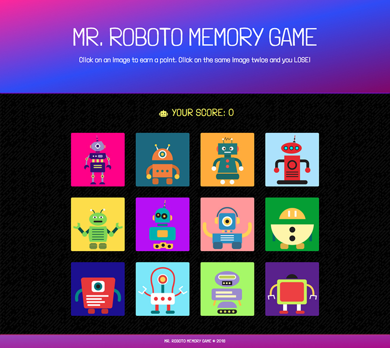

# Mr.Roboto Memory Game

### What is this?

A memory game built with React.

### How does it work?

Player clicks a robot. Once that robot is clicked, it cannot be clicked again or you lose. Every robot is worth 1 point. Click all 12 robots and you win.

_Please note:_ hover state of robots is a shake. Don't be alarmed.

### Screenshots

### Technologies Applied

* HTML
* CSS
* Bootstrap
* Yarn
* [Create React App](https://github.com/facebookincubator/create-react-app).

    * Below you will find some information on how to perform common tasks. You can find the most recent version of this guide [here](https://github.com/facebookincubator/create-react-app/blob/master/packages/react-scripts/template/README.md).

